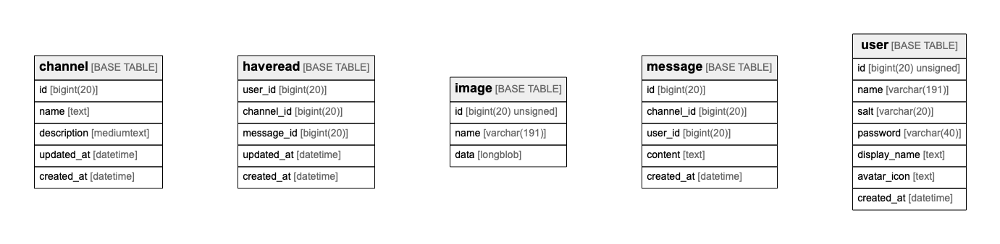

# isubata

## Tables

| Name | Columns | Comment | Type |
| ---- | ------- | ------- | ---- |
| [channel](channel.md) | 5 |  | BASE TABLE |
| [haveread](haveread.md) | 5 |  | BASE TABLE |
| [image](image.md) | 3 |  | BASE TABLE |
| [message](message.md) | 5 |  | BASE TABLE |
| [user](user.md) | 7 |  | BASE TABLE |

## Relations

---

> Generated by [tbls](https://github.com/k1LoW/tbls)
