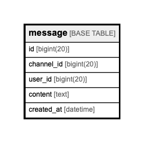

# message

## Description

<details>
<summary><strong>Table Definition</strong></summary>

```sql
CREATE TABLE `message` (
  `id` bigint(20) NOT NULL AUTO_INCREMENT,
  `channel_id` bigint(20) DEFAULT NULL,
  `user_id` bigint(20) DEFAULT NULL,
  `content` text,
  `created_at` datetime NOT NULL,
  PRIMARY KEY (`id`)
) ENGINE=InnoDB AUTO_INCREMENT=14705 DEFAULT CHARSET=utf8mb4
```

</details>

## Columns

| Name | Type | Default | Nullable | Children | Parents | Comment |
| ---- | ---- | ------- | -------- | -------- | ------- | ------- |
| id | bigint(20) |  | false |  |  |  |
| channel_id | bigint(20) |  | true |  |  |  |
| user_id | bigint(20) |  | true |  |  |  |
| content | text |  | true |  |  |  |
| created_at | datetime |  | false |  |  |  |

## Constraints

| Name | Type | Definition |
| ---- | ---- | ---------- |
| PRIMARY | PRIMARY KEY | PRIMARY KEY (id) |

## Indexes

| Name | Definition |
| ---- | ---------- |
| PRIMARY | PRIMARY KEY (id) USING BTREE |

## Relations



---

> Generated by [tbls](https://github.com/k1LoW/tbls)
